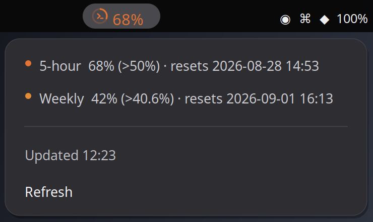
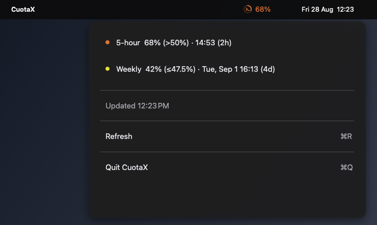
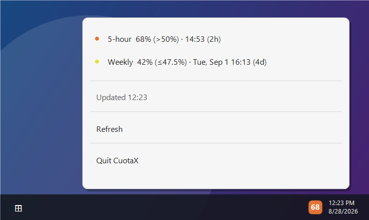

# CuotaX

A minimal GNOME Shell extension, native macOS menu-bar app, and native Windows
notification-area app that show the highest active Codex quota percentage. The
menu shows the 5-hour and weekly quotas with local reset times.

| GNOME                                                                                            | macOS                                                                                           | Windows                                                                                                        |
| ------------------------------------------------------------------------------------------------ | ----------------------------------------------------------------------------------------------- | -------------------------------------------------------------------------------------------------------------- |
| [](.github/screenshots/gnome.png) | [](.github/screenshots/macos.png) | [](.github/screenshots/windows.png) |

Screenshots use representative quota data and are generated on each platform by CI.

Every five minutes, CuotaX reads `account/rateLimits/read` from the experimental
Codex app-server interface using `codex app-server --stdio`. This does not start
a model turn or consume quota.

## GNOME Shell

### Requirements

- GNOME Shell 50
- Codex CLI, logged in with ChatGPT
- `gnome-extensions` for packaging and installation
- Node.js and npm for development

### Build

```bash
make build
```

### Install

```bash
make install
```

After the first installation on Wayland, log out and back in, then run
`make enable`.

### Development

```bash
npm --prefix gnome install
make lint
make format-check
make test
```

`make format` rewrites supported files.

Test against the active Codex account:

```bash
CODEX_TEST_COMMAND="$(command -v codex)" CODEX_TEST_LIVE=1 \
  gjs -m gnome/tests/test_backend.js
```

### Uninstall

```bash
make uninstall
```

## macOS

Building the native SwiftUI app requires Swift 6.0 or newer. The app runs on
macOS 13 or newer and requires the Codex CLI logged in with ChatGPT. It has no
Dock icon, refreshes every five minutes, and ensures it is registered as a login
item whenever it launches.

Build, install to `~/Applications`, and launch:

```bash
make install
```

Run the macOS tests:

```bash
make test
```

Unregister the login item and remove the app:

```bash
make uninstall
```

The development build is ad-hoc signed locally. Distribution to other
Macs requires signing and notarization with an Apple Developer identity.

## Windows

The native Windows notification-area app requires the .NET 10 SDK to build and
the .NET 10 Desktop Runtime to run. It also requires the native Windows Codex
CLI logged in with ChatGPT. The tray icon shows the highest active quota as a
two-digit overlay. Exhausted quota is shown as a deep-red `×`, while backend or
authentication failures use a distinct `!` icon.

Build the framework-dependent single-file executable:

```powershell
powershell -ExecutionPolicy Bypass -File windows/scripts/build.ps1
```

Install to `%LOCALAPPDATA%\Programs\CuotaX`, register it to start with Windows,
and launch it:

```powershell
powershell -ExecutionPolicy Bypass -File windows/scripts/install.ps1
```

Run the Windows tests:

```powershell
dotnet run --project windows/CuotaX.Tests/CuotaX.Tests.csproj --configuration Release
```

For development, launch without changing startup registration:

```powershell
dotnet run --project windows/CuotaX/CuotaX.csproj -- --no-register
```

Remove the startup registration and installed app:

```powershell
powershell -ExecutionPolicy Bypass -File windows/scripts/uninstall.ps1
```

The equivalent `make` targets are also available when GNU Make is installed.

The protocol and rate-limit fields are documented in the
[Codex App Server documentation](https://learn.chatgpt.com/docs/app-server#6-rate-limits-chatgpt).
