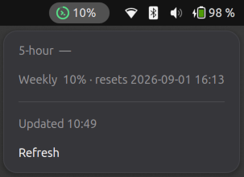

# CuotaX

A minimal GNOME Shell extension that shows the highest active Codex quota
percentage in the top panel. The menu shows the 5-hour and weekly quotas with
local reset times.



Every five minutes, CuotaX reads `account/rateLimits/read` from the experimental
Codex app-server interface using `codex app-server --stdio`. This does not start
a model turn or consume quota.

## Requirements

- GNOME Shell 50
- Codex CLI, logged in with ChatGPT
- `gnome-extensions` for packaging and installation
- Node.js and npm for development

## Build

```bash
make build
```

## Install

```bash
make install
```

After the first installation on Wayland, log out and back in, then run
`make enable`.

## Development

```bash
npm install
make lint
make format-check
make test
```

`make format` rewrites supported files.

Test against the active Codex account:

```bash
CODEX_TEST_COMMAND="$(command -v codex)" CODEX_TEST_LIVE=1 \
  gjs -m tests/gjs/test_backend.js
```

## Uninstall

```bash
make uninstall
```

The protocol and rate-limit fields are documented in the
[Codex App Server documentation](https://learn.chatgpt.com/docs/app-server#6-rate-limits-chatgpt).
